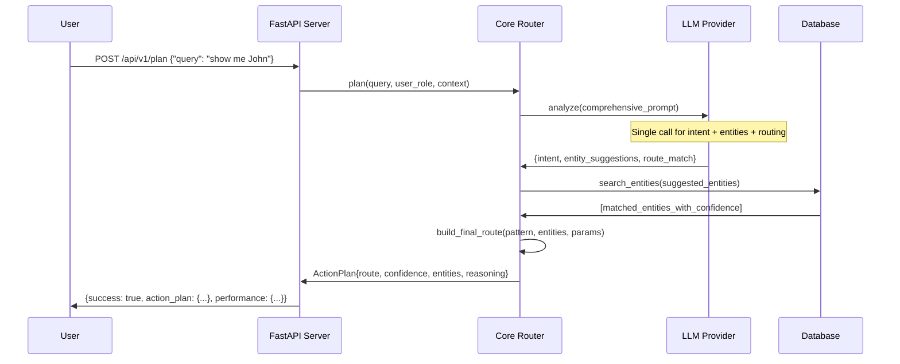

# Architecture Overview

Fantastic Router is built with a modular, pluggable architecture that separates concerns and enables easy customization for different domains and deployment scenarios.

## 🏗️ High-Level Architecture

```
┌─────────────────┐    ┌─────────────────┐    ┌─────────────────┐
│   User Query    │────│  FastAPI Server │────│   Core Router   │
│ "show me John"  │    │  (HTTP/JSON)    │    │  (LLM + Logic)  │
└─────────────────┘    └─────────────────┘    └─────────────────┘
                                                       │
                       ┌─────────────────┐    ┌─────────────────┐
                       │   LLM Provider  │────│  Entity Resolver│
                       │ (GPT/Claude/..) │    │   (Database)    │
                       └─────────────────┘    └─────────────────┘
```

## 📦 Component Architecture

### 1. **FastAPI Server** (`fantastic_router_server`)
- **Purpose**: HTTP API layer, request/response handling
- **Responsibilities**:
  - Request validation and serialization
  - Dependency injection
  - Error handling and logging
  - API documentation generation
  - Background task management

### 2. **Core Router** (`fantastic_router_core`)
- **Purpose**: Business logic and orchestration
- **Responsibilities**:
  - Intent parsing and understanding
  - Entity resolution coordination
  - Route pattern matching
  - Response generation and confidence scoring

### 3. **LLM Adapters** (`adapters/llm/`)
- **Purpose**: Language model integration
- **Supported Providers**:
  - OpenAI (GPT-3.5, GPT-4)
  - Anthropic (Claude)
  - Google (Gemini)
  - Ollama (Local models)
- **Responsibilities**:
  - Prompt engineering and optimization
  - Response parsing and validation
  - Rate limiting and error handling
  - Provider-specific optimizations

### 4. **Database Adapters** (`adapters/db/`)
- **Purpose**: Data access and entity resolution
- **Supported Databases**:
  - PostgreSQL
  - Supabase
  - (Extensible to other databases)
- **Responsibilities**:
  - Schema introspection
  - Entity search and fuzzy matching
  - Connection pooling and management
  - Query optimization

## 🔄 Request Flow



## 🧠 Core Planning Process

### Single-Call Optimization
Our optimized planner combines three traditional steps into one LLM call:

1. **Intent Analysis**: What action type (NAVIGATE, CREATE, EDIT, DELETE, QUERY)
2. **Entity Resolution**: Which database entities are mentioned
3. **Route Matching**: Which URL pattern fits the intent

**Traditional Approach (3 calls)**:
```
Query → Intent Parser → Entity Resolver → Route Matcher → Result
        (LLM Call 1)   (LLM Call 2)     (LLM Call 3)
```

**Optimized Approach (1 call)**:
```
Query → Comprehensive Analyzer → Entity DB Lookup → Result
        (Single LLM Call)       (Database only)
```

### Prompt Engineering
The single call uses a carefully crafted prompt that includes:
- Domain context and entity definitions
- Available route patterns with examples
- Database schema information
- Response format specification (JSON)

## 🔌 Pluggable Components

### LLM Client Protocol
All LLM adapters implement the `LLMClient` protocol:

```python
class LLMClient(Protocol):
    async def analyze(self, prompt: str, temperature: float = 0.1) -> Dict[str, Any]:
        """Analyze a prompt and return structured JSON response"""
        ...
```

### Database Client Protocol
All database adapters implement the `DatabaseClient` protocol:

```python
class DatabaseClient(Protocol):
    async def search_entity(
        self, 
        entity_name: str, 
        tables: List[str], 
        search_fields: List[str]
    ) -> List[EntityMatch]:
        """Search for entities across specified tables"""
        ...
```

## 📊 Data Models

### Core Models (Pydantic)

**ActionPlan**: The final routing result
```python
class ActionPlan(BaseModel):
    action_type: ActionType  # NAVIGATE, CREATE, EDIT, etc.
    route: str              # Final URL path
    confidence: float       # Overall confidence (0-1)
    reasoning: str          # LLM explanation
    parameters: List[RouteParameter]  # URL parameters
    entities: List[EntityMatch]       # Resolved entities
    query_params: Dict[str, str]      # Query parameters
    matched_pattern: str              # Which pattern matched
    alternatives: List[ActionPlan]    # Alternative routes
```

**SiteConfiguration**: Domain-specific setup
```python
class SiteConfiguration(BaseModel):
    domain: str                              # Application domain
    base_url: str                           # Application base URL
    entities: Dict[str, EntityDefinition]   # Available entities
    route_patterns: List[RoutePattern]      # URL patterns
    database_schema: DatabaseSchema         # Database structure
```

**EntityMatch**: Entity resolution result
```python
class EntityMatch(BaseModel):
    id: str           # Primary key
    name: str         # Display name
    table: str        # Source table
    confidence: float # Match confidence
    raw_data: Dict    # Full database record
```

## 🚀 Performance Considerations

### Single-Call Optimization
- **3x faster** than traditional multi-call approaches
- Reduces LLM API costs significantly
- Better consistency in reasoning

### Caching Strategy
- **Entity cache**: Recent entity lookups
- **Schema cache**: Database structure
- **Route cache**: Compiled route patterns
- **LLM cache**: Identical query responses

### Async Architecture
- Non-blocking I/O throughout
- Concurrent entity resolution
- Background performance logging
- Graceful error handling

## 🔒 Security Architecture

### Authentication Flow
```
User Request → API Key/JWT → Role Extraction → RBAC Check → Route Access
```

### Access Control
- **Route-level RBAC**: Each route pattern can specify required roles
- **Entity-level filtering**: Database queries filtered by user permissions
- **Audit logging**: All requests logged with user context

### Input Validation
- **Pydantic models**: Strong typing and validation
- **Query sanitization**: Prevent injection attacks
- **Rate limiting**: Prevent abuse
- **Content filtering**: Block inappropriate queries

## 🏭 Deployment Architecture

### Docker Composition
```yaml
services:
  app:          # FastAPI server + Core router
  postgres:     # Primary database
  pgadmin:      # Database management (optional)
  redis:        # Caching layer (future)
  monitoring:   # Performance monitoring (future)
```

### Kubernetes Architecture
```
┌─────────────┐    ┌─────────────┐    ┌─────────────┐
│   Ingress   │────│   Service   │────│     Pod     │
│  (routing)  │    │ (discovery) │    │ (container) │
└─────────────┘    └─────────────┘    └─────────────┘
                                              │
                   ┌─────────────┐    ┌─────────────┐
                   │  ConfigMap  │────│   Secret    │
                   │ (settings)  │    │ (API keys)  │
                   └─────────────┘    └─────────────┘
```

## 🎯 Extension Points

### Custom LLM Providers
Implement the `LLMClient` protocol to add new LLM providers:
```python
class CustomLLMClient:
    async def analyze(self, prompt: str, temperature: float = 0.1) -> Dict[str, Any]:
        # Your custom LLM integration
        return {"action_type": "NAVIGATE", ...}
```

### Custom Database Adapters
Implement the `DatabaseClient` protocol for new databases:
```python
class CustomDatabaseClient:
    async def search_entity(self, entity_name: str, tables: List[str], search_fields: List[str]) -> List[EntityMatch]:
        # Your custom database search logic
        return [EntityMatch(...), ...]
```

### Custom Route Patterns
Define domain-specific routing patterns:
```json
{
  "pattern": "/custom/{entity_type}/{action}",
  "name": "custom_action",
  "description": "Custom domain actions",
  "intent_patterns": ["perform {action} on {entity}"]
}
```

## 📈 Monitoring and Observability

### Metrics Collected
- **Request latency**: End-to-end timing
- **LLM performance**: Provider-specific metrics  
- **Entity resolution**: Search success rates
- **Route matching**: Pattern hit rates
- **Error rates**: By endpoint and error type

### Logging Strategy
- **Structured logging**: JSON format for parsing
- **Request tracing**: Unique IDs for debugging
- **Performance logging**: Background task collection
- **Error aggregation**: Centralized error tracking

---

**Next**: [API Reference](api.md) | **Previous**: [Quick Start](quickstart.md)
